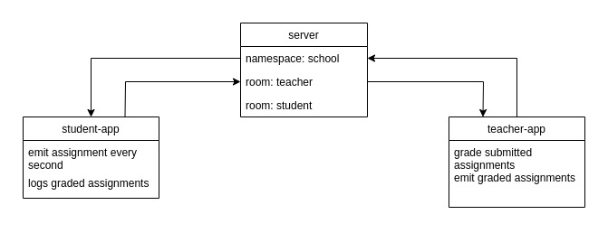

# 401-lab-18

## Socket.io

### Author: Travis Skyles

### Links and Resources
* [submission PR]()
* [travis]()

### Docs
* run live-server on /docs/index.html

#### How to initialize/run your server app
- run commands in three seperate terminals
* node server.js
* node instructor/instructor.js
* node students/student.js
  
#### Tests
* Unit Tests: `npm test`
* Lint Tests: `npm run lint`

#### UML
